# Pausing and Resuming CastAI Managed Kubernetes Cluster in EKS

This project is designed to provide DevOps teams the ability to pause and resume their kubernetes clusters during non-business hours. This can reduce the cost of running a cluster by 52% if the cluster is paused for 8 hours overnight and 48 hours on the weekend for a total of 88 paused hours each week. This can be higher or lower depending on the working hours of the team and can always be overridden through the UI if a cluster needs to be resumed during off hours. 

We will go through setting up the lambda function and the EventBridge triggers for setting the schedule. 

## Prerequisites
This tutorial assumed the commands are being run from a machine with a linux command line interface, Mac OS or Linux. You may experience different behaviors if running on a Windows platform. 
- Go installed on the local machine
- Access to create a Secret in AWS
- Access to adjust an IAM Role in AWS
- Access to create a Lambda in AWS
- AWS CLI Configured for your account - Optional, UI can be used as well

## Setup the CastAI API Key

First create an API Key within CastAI and store the key in the AWS Secrets Manager. This key will be securely retrieved by the Lambda function in order to interact with the CastAI API's. 

Login to the CastAI UI, go to the "API" section in the upper left, then go to "API access keys"


Select "Create access key" and create a key with a name that makes sense for the purpose. 


In the AWS Console, go to AWS Secret Manager and select "Store a new secret" 

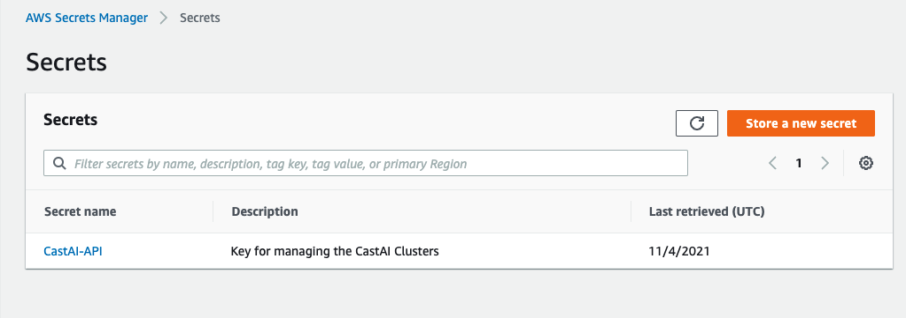

Set the "Secret type" to "Other type of secret", use the key/value pair with a key name of: "CastAIKey" and a value of the api key copied from the CastAI Console. 


Select "Next" and configure the name of the secret to be: "CastAI-API" with a description that makes sense. 

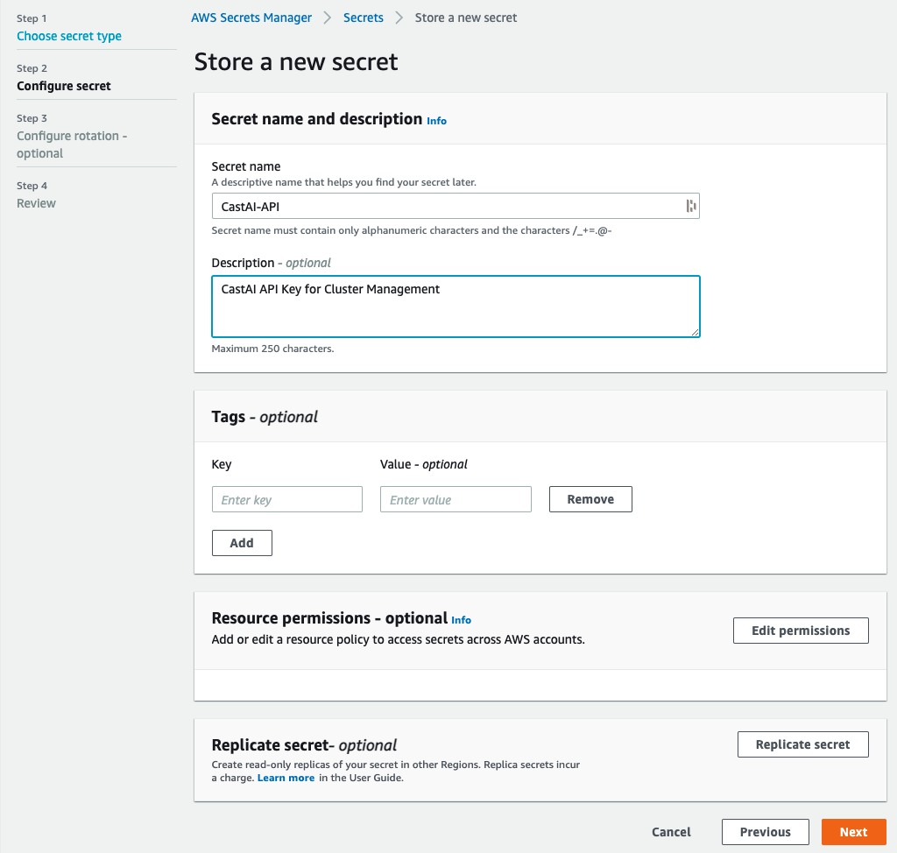

Select "Next" until the review then save the key. 

## Create the Lambda Function

Go to the AWS Lambda section and "Create Function", name the function something intelligent like "Panda-Ardvark-Spitoon", or just **"CastAI-PauseClusterOnSchedule"** whatever your preference. If you name it something different you can update the build.sh with the new name. 

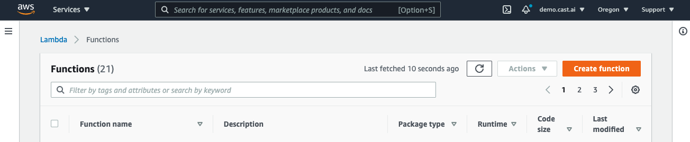

Select the Go 1.x runtime and x86_64 architecture, Lambda does not support Go on arm64 at the time this was written. 

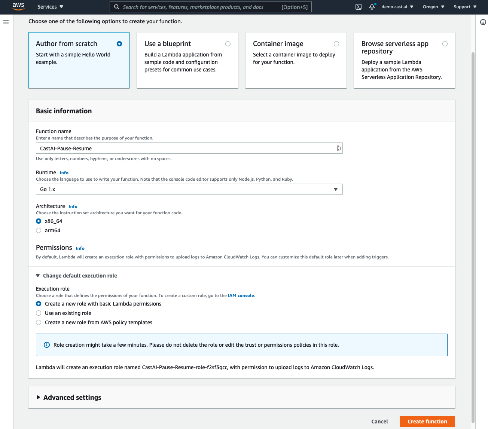

Leave the default execution role as "Create a new role with basic Lambda permissions" we will expand this role to include access to the Secret APIKey later. 

After creating the function, go to the "Code" tab, and edit the "Runtime settings" section, to change the handler from the default to "pause-resume-cluster" which is the name of our executable. 

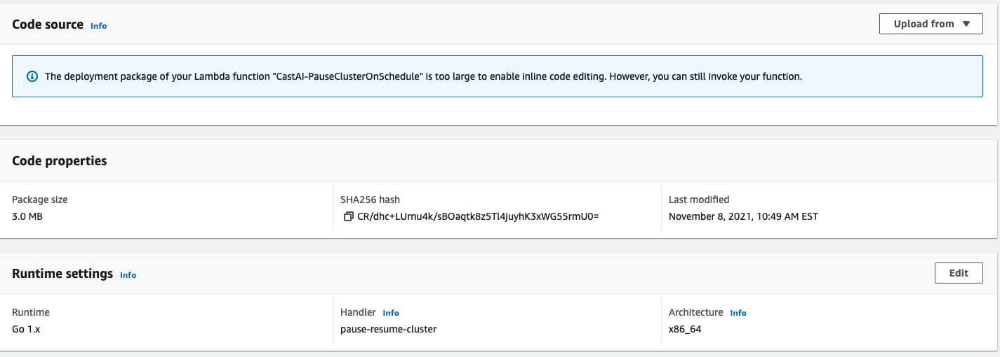

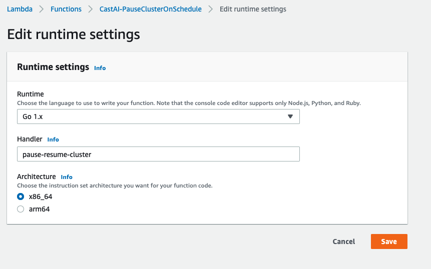

Add permission for the Lambda function to access the secret created above. Go to the "Configuration" section of the Lambda function, then select "Permissions" tab, this will display the role name, click on the role name to edit the permissions of the Lambda function. 

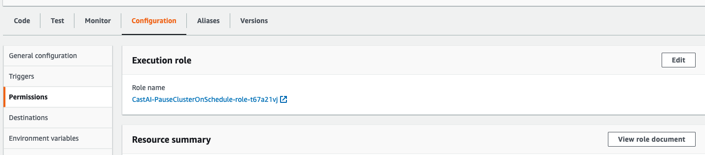

Add an in-line policy specifying the ARN of the secret created above, this will allow the Lambda function to retrieve the Cast.AI API Key. 

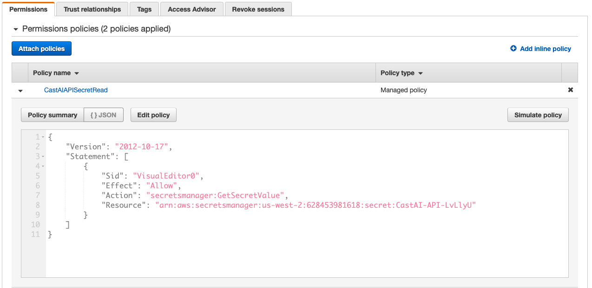

## Build the executable and upload

Clone the git repository and run `build.sh` 
> If the AWS CLI is setup properly, set the lambda_name variable in build.sh and the lambda will automatically be uploaded after the build. 

The build will generate the executable needed by Lambda then zip it to be deployed. The zip file can be uploaded by hand or can be submitted using the AWS CLI. 

## Setup the EventBridge triggers for the Lambda

The scheduling function is triggered using AWS Eventbridge, go to the AWS EventBridge service and select "Create Rule". 

Give the rule a name, in our case we have used "PauseCluster" and "ResumeCluster" for the rules. 

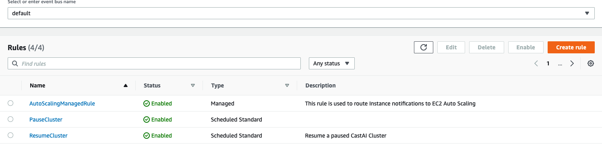

Under Define Pattern select "Schedule" and "Cron expression", for the cron expression enter the time you wish the cluster to be paused, in the example we use 9pm GMT, 0 9 * * ? *

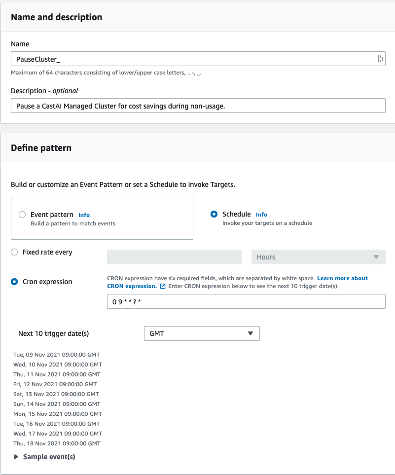

In the "Select Targets" section set the Target to "Lambda Function", and select the Lambda function you have created above and uploaded the build. 

Expand the "Configure Input" selection and choose "Constant (json text)", this will allow you to enter a json payload to be sent to the Lambda. The json payload should be structured as follows: 

```{"clusterNames": ["boutique-110821-pa-AcmeCo"], "action": "pause"}```

The clusterNames field is an array of cluster names in your CastAI Organization what you would like paused, the action is "pause" as we are setting the time the clusters will be paused. 

For Pause: 


For Resume: 
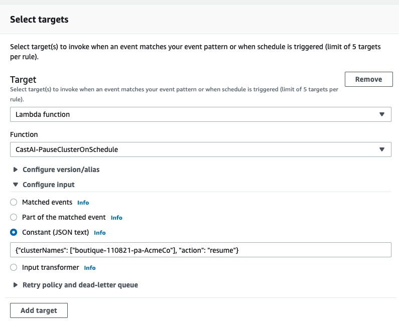

Save the event and create a second event for the resume portion, the second event will be identical to the first but with a different cron expression and the action will be "resume" rather than pause. 

```{"clusterNames": ["boutique-110821-pa-AcmeCo"], "action": "resume"}```

Pause and Resume can be any set of clusters, for example, if you'd like to pause all clusters at the same time, but resume them at different times you could use multiple resume events with a single pause event or vice versa. 

## Testing

In order to validate your lambda is working properly you can use the "Test" section of AWS Lambda, set the **Test event** to "New event" and select the "hello-world" template. In the json body supply the clusterName of the cluster you would like to test and the action "pause", verify in the Cast.AI console the cluster is pausing. Change the action to "resume" and run the test again to verify the cluster resumes operation. 

```{"clusterNames": ["ExampleCluster"], "action": "pause"}```

```{"clusterNames": ["ExampleCluster"], "action": "resume"}```

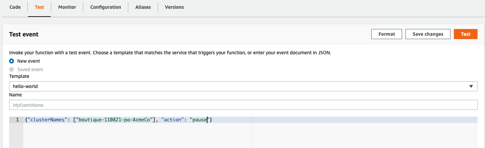

The Cast.AI console will switch to "Pausing" then to "Paused" when the operation is complete. 

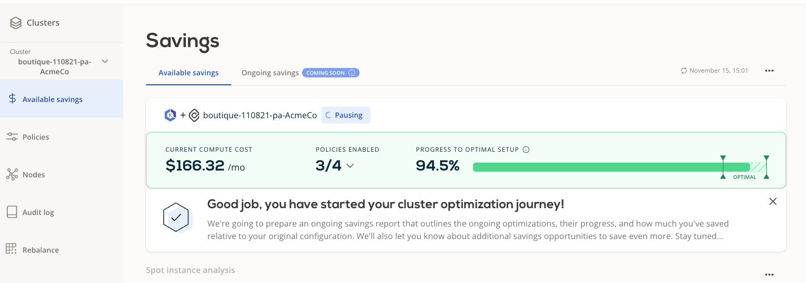

Once the operation is complete, change to the resume action, re-run the test and the cluster will re-activate. This will prove the end-to-end works properly. The cluster will now be paused and resumed based on the schedule created for the EventBridge actions. If the cluster needs to be resumed mid-cycle it can be done from the Cast.AI Console or by running the test against the Lambda. 


## Flow Diagram

Call flow for pause/resume workflow

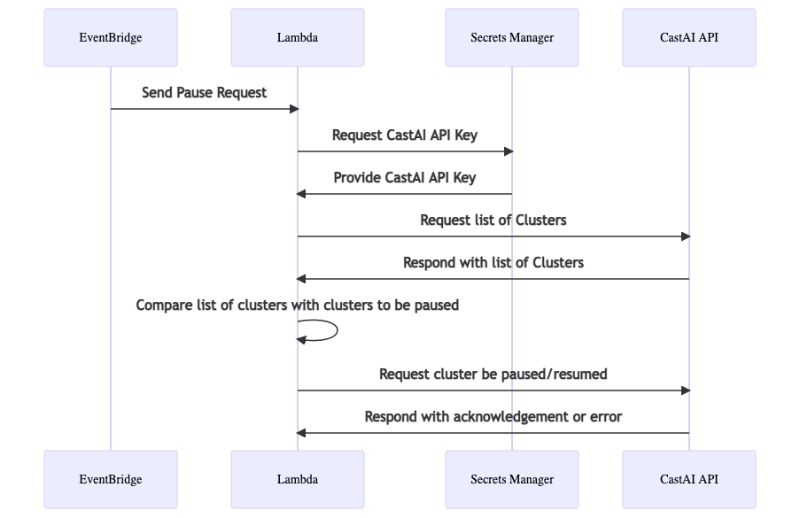
