# Pausing and Resuming CastAI Managed Kubernetes Cluster in GCP

This project is designed to provide DevOps teams the ability to pause and resume their kubernetes clusters during non-business hours. This can reduce the cost of running a cluster by 52% if the cluster is paused for 8 hours overnight and 48 hours on the weekend for a total of 88 paused hours each week. This can be higher or lower depending on the working hours of the team and can always be overridden through the UI if a cluster needs to be resumed during off hours. 

We will go through setting up the Google Function and the Cloud Scheduler triggers for setting the schedule. 

## Prerequisites
This tutorial assumes the user has access to create resources within GCP and has Member or Owner access to the clusters in CastAI. 
- Permissions to create the following resources:
    * Cloud Functions
    * Cloud Scheduler Tasks
    * Secrets in Secret Manager

## Architecture

There are several methods of triggering a function to run in GCP, in this document we will use the pub-sub model as it is the most secure and easiest to configure. 

There will be 3 main components, the Function, the Secret and the Scheduler, these will combine to automate the pausing and restarting of kubernetes clusters. 

### Cloud Function
The Cloud Function will consist of a simple python3.7 application that will take in the secret and make calls to the CastAI API in order to either pause or resume the cluster. 

### Secret
The Secret will be the storage of the CastAI API Key, this will allow the function to communicate securely with CastAI and keep your environment secure by not exposing any secrets in text anywhere in your environment. 

### Scheduler
The Cloud Scheduler will allow you to issue commands to the function on a cron schedule, you can have many to one relationship where different schedules control different clusters but they will all use the same function. 

## Setup the Cast AI Key

First create an API Key within CastAI and store the key in the AWS Secrets Manager. This key will be securely retrieved by the Lambda function in order to interact with the CastAI API's. 

Login to the CastAI UI, go to the "API" section in the upper left, then go to "API access keys"


Select "Create access key" and create a key with a name that makes sense for the purpose. 


In the GCP Console, go to the Secret Manager product, this can be found under "Security" section of products, or quickly searched in the top search bar. 

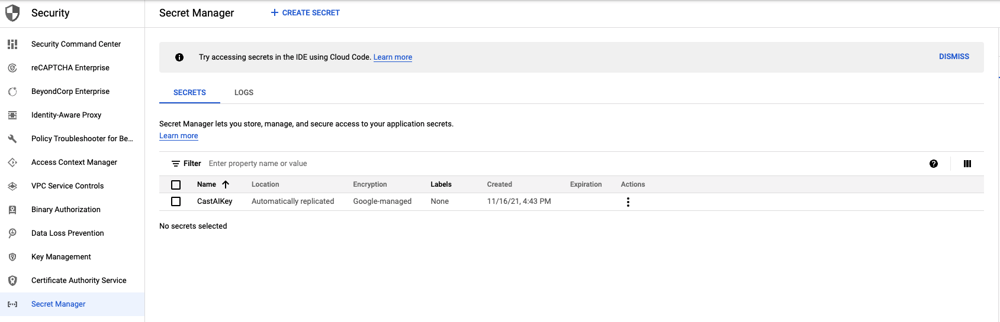

Select "CREATE SECRET" at the top near the "Secret Manager" title to add a new secret. 

Once the create secret screen is open name the secret something that conveys meaning to your organization. CastAIAPIKey or something similar will work. 

Paste the key that was generated on CastAI's console into the Secret Value section. The remaining options can be left un-checked unless your organization requires customer-managed encryption, if so choose your encryption key. 

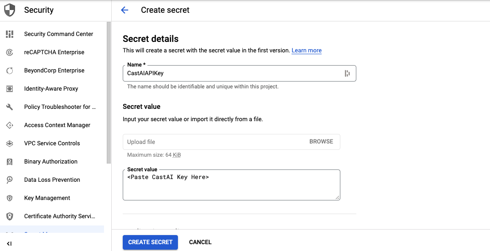

## Setup Cloud Function

Go to the Cloud Functions product under "Serverless" in the sidebar menu. Here we will create a new function to handle the pause/resume for the clusters. 

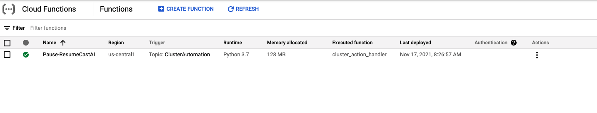

Select the "CREATE FUNCTION" button at the top next to the "Functions" heading, we will then configure our function. 

Enter a name for the function and select the region you would like the function to run in. For trigger select "Cloud Pub/Sub" and create a new topic for the purpose of triggering the function. Name the topic something like "CastAITrigger" or something that will be meaningful in your environment. Save the settings for the top section and move on to the bottom section. 

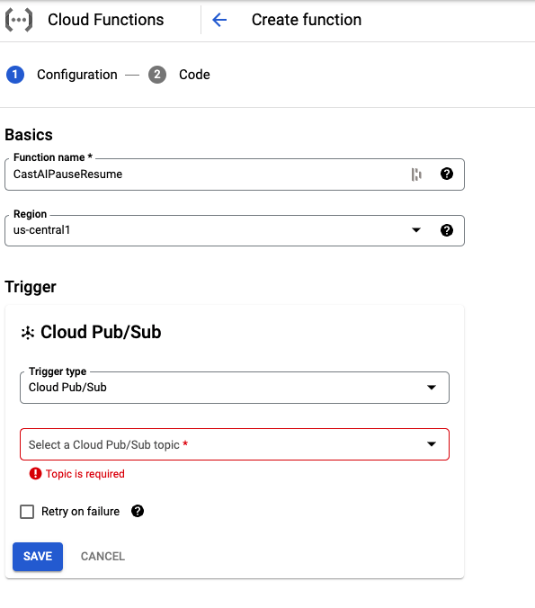

In the Runtime section select 128MB of memory and leave the rest as default, 

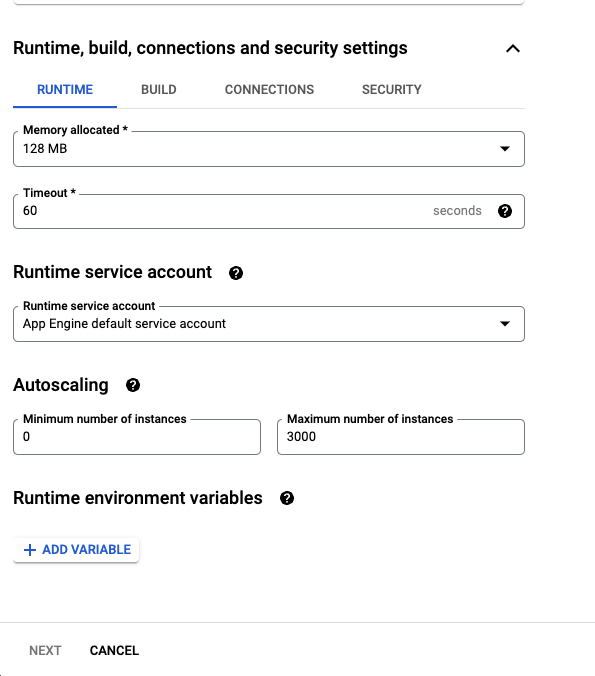

Move to the Connections tab and select "Allow Internal Only"

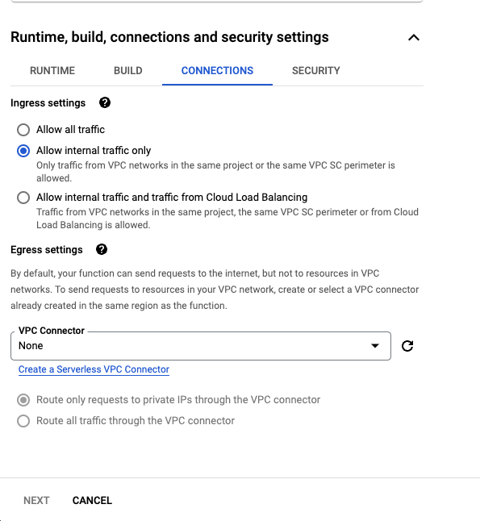

Lastly, switch to the Security tab and select "Reference a Secret", select the secret that was created in the first section. For "Reference Method" select Expose as Environment Variable, set the Name as `CastAIKey`

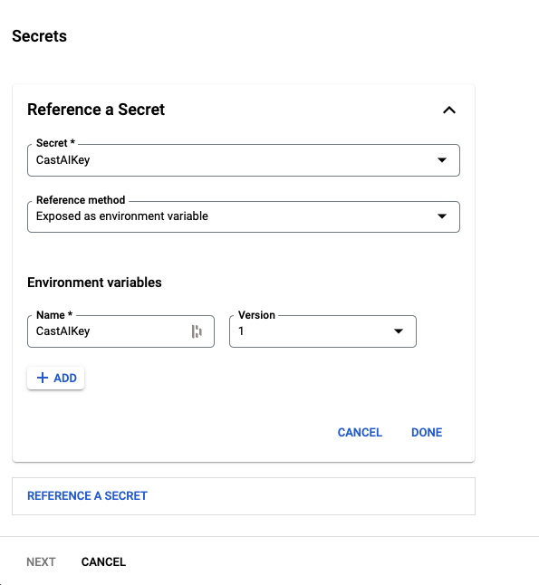

Select "Next" and move on to adding code to the function, when at the "Code" screen, select the Runtime as "Python 3.7" and set hte Entry point to be: **cluster_action_handler**, copy the code from pause-resume.py and paste into the Inline Editor then click the **Deploy** button at the bottom. 

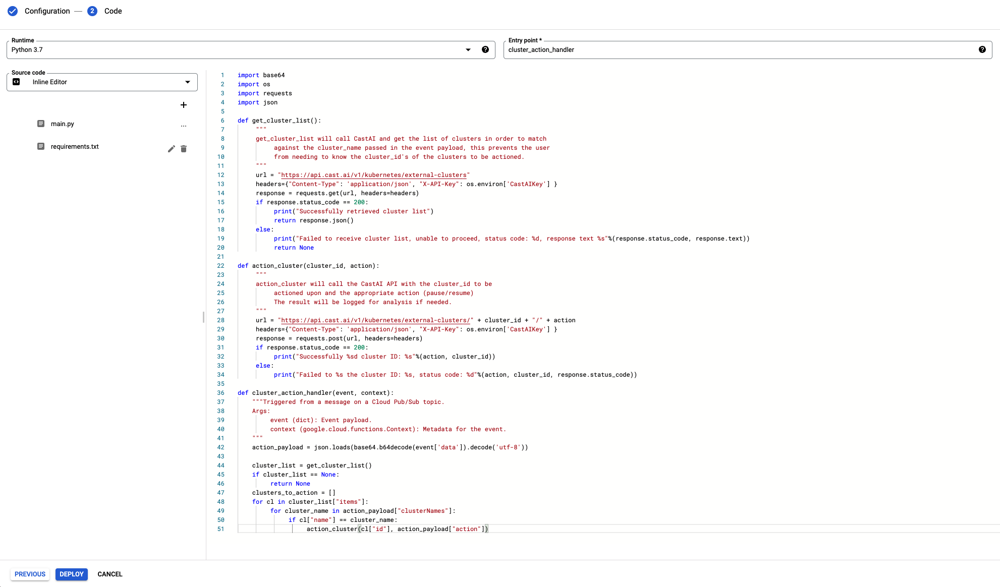

## Cloud Scheduler

In Cloud Scheduler we'll create 2 jobs, one for pause and one for resume, you can have several different schedules for different clusters by creating additional jobs. 

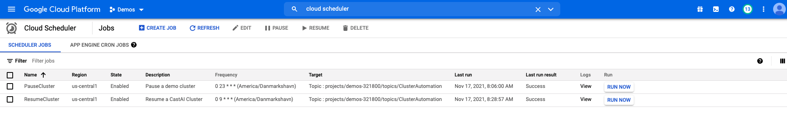

Select **Create Job** at the top next to "Cloud Scheduler", this will allow you to define the schedule for the job and configure it. 
Name the job something useful `CastAI-Pause` or similar with a useful description. 
Set the frequency using Cron notaton, for example, to pause the cluster at 6pm UTC set the Frequency to `0 18 * * *` and Timezone to UTC. 

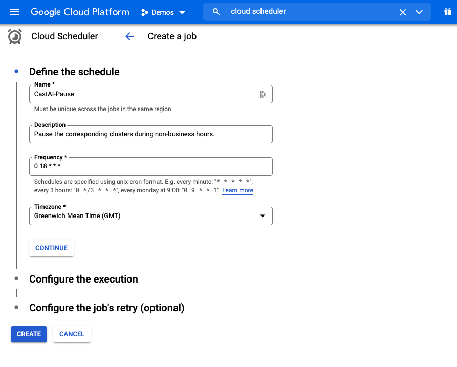

Select **Continue** to move on to setting the target

In the "Configure the execution" section set the **Target Type** to "Pub/Sub", select the pub/sub topic that was created in the previous step. 

Set the **Message Body** parameter to the following payload structure: 

```{"clusterNames": ["ExampleCluster"], "action": "pause"}```

Where **ExampleCluster** is replaced with the cluster(s) you wish to have paused at that time, this can take an array for example: 

```{"clusterNames": ["ExampleCluster", "ExampleCluster2"], "action": "pause"}```

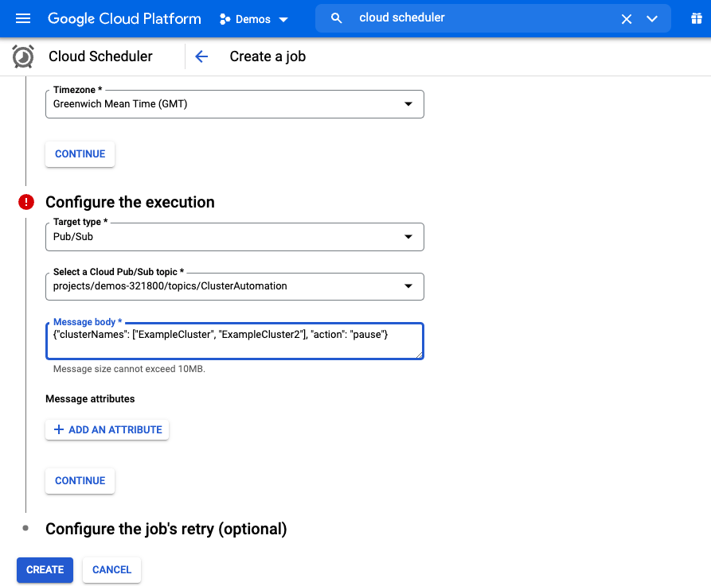

Set the resume job with the same procedure as the pause job with a different cron time and change the action to "resume": 

```{"clusterNames": ["ExampleCluster", "ExampleCluster2"], "action": "resume"}```

Cron example if you wish the cluster to restart at 7am UTC: 

`0 7 * * *` and Timezone to UTC. 
